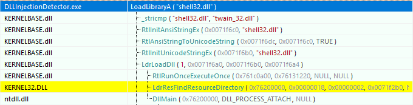
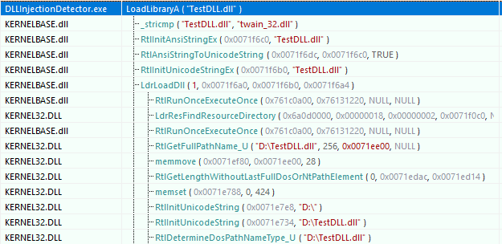
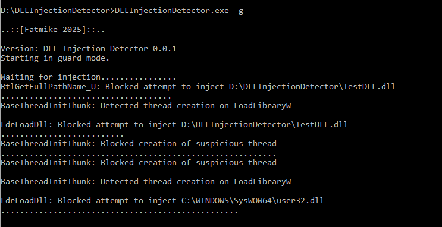

# Fatmike's DLL Injection Detector  

A DLL Injection Detector for Windows.  

## Disclaimer  

The DLL Injection Detector currently supports only x86. However, it can be easily adapted for x64 by replacing the API hooking engine with one that is compatible with 64-bit environments, such as **Microsoft Detours**.
My primary goal was to focus on the core functionality of injection detection without introducing unnecessary overhead from large external libraries. Since API hooking is significantly simpler in x86, I chose to implement a minimalistic, custom hooking mechanism that is sufficient for the intended purpose.  

## Usage  

``DLLInjectionDetector.exe -m``  : Start in monitoring mode (monitoring only)  
``DLLInjectionDetector.exe -g``  : Start in guard mode (blocking dll injections)  

## A Brief Introduction to DLL Injection  

The easiest way to inject a DLL into a running process is to use the Windows APIs *OpenProcess*, *VirtualAllocEx*, *WriteProcessMemory*, *GetProcAddress* and *CreateRemoteThread*:  

- *OpenProcess* : Open the target process using its process ID

- *VirtualAllocEx* : Allocate memory inside the target process to store the DLL path.

- *WriteProcessMemory* : Write the DLL path into that memory.

- *GetProcAddress* : Get the address of *LoadLibraryA* to load the DLL.

- *CreateRemoteThread* : Create a remote thread in the target process that calls *LoadLibraryA* with the DLL path as parameter, causing the process to load (inject) the DLL.  

In addition to this straightforward method, there are alternative techniques for injecting a DLL into a process, such as thread hijacking, where an existing thread is used to load the DLL.  

## Detecting DLL Injection  

To detect when another process attempts to inject a DLL into our process, certain well-known APIs can be hooked. Since DLL injector applications often rely on low-level system APIs from ntdll.dll rather than higher-level user-mode APIs like those in kernel32.dll, it is preferable to hook the system APIs directly whenever possible.

- *LdrLoadDll* (Module: *ntdll.dll*) : Handles the loading of DLLs.
- *BaseThreadInitThunk* (Module: *kernel32.dll*) : Called during thread creation. Useful for detecting remote thread injection.
- *RtlGetFullPathName_U* (Module: *ntdll.dll*) : Resolves full paths of DLLs being loaded.  
  
While *LdrLoadDll* and *BaseThreadInitThunk* are obvious candidates for hooking, *RtlGetFullPathName_U* is less so. This function is internally used by *LdrLoadDll*, but only seems to be involved in the code path used for loading non-system (i.e., non-Windows) DLLs.  
I have tested this using the tool **API Monitor 2.0** (http://www.rohitab.com/):

  
Loading *shell32.dll* : *LdrLoadDll* does not call *RtlGetFullPathName_U*  

  
Loading custom *TestDLL.dll* : *LdrLoadDll* calls *RtlGetFullPathName_U*  

## Solution Overview  

The solution consists of the projects ``DLLInjectionDetector`` which serves as the main project and ``TestDLL``, a simple DLL that can be used for injection into ``DLLInjectionDetector.exe``.  

### Implementation Notes  

#### Class InjectionDetector  

- Installs the mentioned hooks within the ``InjectionDetector::Initialze``  method
- Forwards hook calls to implementations of the ``IInjectionHandler`` interface

#### Class InjectionMonitor  

- Implements the ``IInjectionHandler`` interface
- Solely monitors hook events and outputs information to the console.  

#### Class InjectionGuard  

- Implements the ``IInjectionHandler`` interface  
- Monitors hook events, logs information to the console, and actively blocks DLL injection attempts  

## Screenshot  

  

## Results with Various DLL Injection Tools  

| Tool                    	| Method             	| Result  	|
|-------------------------	|--------------------	|---------	|
| Extreme Injector v3.7.3 	| Standard Injection 	| blocked 	|
| Extreme Injector v3.7.3 	| Thread Hijacking   	| blocked 	|
| Extreme Injector v3.7.3 	| LdrLoadDllStub     	| blocked 	|
| Extreme Injector v3.7.3 	| LdrpLoadDllStub    	| blocked 	|
| Extreme Injector v3.7.3 	| Manual Map         	| blocked 	|
| Process Hacker 2.39.124 	| Standard Injection 	| blocked 	|
| ScyllaHide              	| Normal Injection   	| blocked 	|
| ScyllaHide              	| Stealth Injection  	| blocked 	|